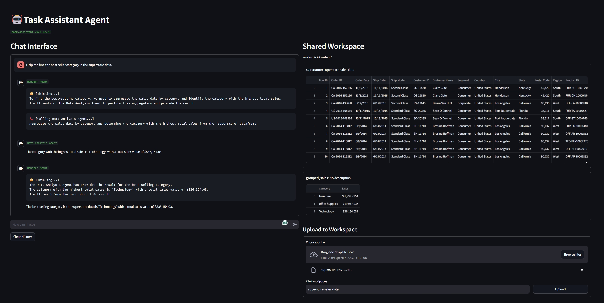

# Multi-Agent Task Solving System with Workspace Sharing

This repository contains a Python-based multi-agent system that facilitates task management and execution using a combination of **manager agents** and **worker agents**. The system is designed to provide a collaborative workspace for agents to share resources such as data frames and text, enabling them to execute complex tasks effectively.



---

## **Table of Contents**
- [Overview](#overview)
- [Key Features](#key-features)
- [Architecture](#architecture)
  - [Manager Agent](#manager-agent)
  - [Worker Agent](#worker-agent)
- [Workspace](#workspace)
- [Setup and Installation](#setup-and-installation)
- [Usage](#usage)
  - [Python API](#python-api)
  - [Streamlit Frontend](#streamlit-frontend)
- [Future Enhancements](#future-enhancements)
- [License](#license)

---

## **Overview**

This multi-agent system is built for automating complex workflows by decomposing tasks into subtasks, delegating them to specialized worker agents, and integrating their outputs. The manager agent orchestrates this process, ensuring proper execution and utilizing shared resources in the workspace.

---

## **Key Features**

- **Hierarchical Agent Structure**: 
  - Manager agents route user instructions to appropriate worker agents.
  - Worker agents interact with tools to execute specific tasks (e.g., search, coding, data analysis).

- **Shared Workspace**:
  - A collaborative environment for caching resources (e.g. data frames, text).
  - Enables seamless communication and resource sharing among agents and users.

- **Tool Integration**:
  - Easily integrates tools like search engines, Python code interpreters, and data analysis utilities.

- **Modular and Extensible**:
  - Scalable architecture for adding new tools, agents, and capabilities.

- **Streamlit-Based Frontend**:
  - User-friendly interface for interacting with agents and managing the shared workspace.

- **Logging and Debugging**:
  - Comprehensive logging for monitoring agent activities.

---

## **Architecture**

### **Manager Agent**

The manager agent coordinates tasks by:
- Parsing user instructions.
- Decomposing tasks into subtasks.
- Assigning subtasks to the appropriate worker agents.
- Maintaining a shared workspace for collaboration.

### **Worker Agent**

Worker agents specialize in executing tasks using integrated tools:
- **Search Agents**: Perform web-based searches to gather information.
- **Coding Agents**: Solve logical problems by running Python code.
- **Data Analysis Agents**: Execute operations on data frames cached in the workspace.

---

## **Workspace**

The workspace is a shared environment where agents and users can:
- Cache resources like data frames or text.
- Use metadata to describe the cached resources.
- Perform operations or share outputs to assist in task execution.

---

## **Setup and Installation**

### Prerequisites
- Python 3.8 or higher
- Required libraries: Install from `requirements.txt`

### Installation
1. Clone the repository:
   ```bash
   git clone https://github.com/Neutrino1998/agentic-task-solver.git
   cd agentic-task-solver
   ```

2. Install dependencies:
   ```bash
   pip install -r requirements.txt
   ```

3. Add API keys to `.env` file:
   ```properties
   DASHSCOPE_API_KEY=sk-xxx
   GROQ_API_KEY=gsk_xxx
   DEEPSEEK_API_KEY=sk-xxx
   BING_SUBSCRIPTION_KEY=xxx
   ```

4. Add tools under `./tools`

---

## **Usage**

### Python API

#### Example 1: Pre-config Agents under `./agents/preconfig_agents.py`
```python
from tools.search import bing_search_engine
from tools.code_interpreter import execute_python_code, execute_python_code_with_df
from agents.worker import WorkerAgent
from agents.manager import ManagerAgent

search_agent = WorkerAgent(
    agent_name="Search Agent",
    agent_description="A search agent which can gather information online and solve knowledge related task.",
    recursion_limit=25,
    tools=[bing_search_engine],
    llm="qwen2.5-72b-instruct",
    verbose=True
)

coding_agent = WorkerAgent(
    agent_name="Coding Agent",
    agent_description="A coding agent which can solve logical task with python code.",
    recursion_limit=25,
    tools=[execute_python_code],
    llm="qwen2.5-72b-instruct",
    verbose=True
)

data_analysis_agent = WorkerAgent(
    agent_name="Data Analysis Agent",
    agent_description="A data analysis agent which can execute python code on given dataframe cached in workspace.",
    recursion_limit=25,
    tools=[execute_python_code_with_df],
    llm="qwen2.5-72b-instruct",
    verbose=True
)

manager_agent_with_workspace = ManagerAgent(
    agent_name="Manager Agent",
    agent_description="A manager agent which can direct a search agent with knowledge related task, \
        a coding agent with logic related task, \
        and a data analysis agent which can execute python code on given dataframe cached in workspace.",
    recursion_limit=25,
    tools=[],
    subordinates=[search_agent, coding_agent, data_analysis_agent],
    workspace={},
    llm="qwen2.5-72b-instruct",
    verbose=True)
```

#### Example 2: Manager Agent with Workspace
```python
from agents.preconfig_agents import manager_agent_with_workspace
import asyncio
from utility.data_loader import load_csv_to_dataframe
from my_logger import CURRENT_PATH
import os
file_name = 'superstore.csv'  
file_path = os.path.join(CURRENT_PATH, 'data', 'csv', file_name)
df = load_csv_to_dataframe(file_path)
manager_agent_with_workspace.update_workspace({
        "superstore": {
            "content": df,
            "metadata": {
                "description": "This is a dataframe of superstore's sales data."
                }
        },
    })

if df is not None:
    test_result_workspace = asyncio.run(manager_agent_with_workspace(
        message=HumanMessage(
            content="Help me find the best seller category in superstore data.",
            name="User"
        )
    ))
```

### **Streamlit Frontend**

We provide a **Streamlit-based frontend** to facilitate interactions with agents and the shared workspace. 

#### Key Features
- **Chat Interface**: Send instructions to the manager agent and view their responses.
- **Workspace Viewer**: Display cached resources (e.g., data frames, text) in the workspace.
- **File Uploads**: Upload files (CSV, JSON, TXT) to the workspace with descriptions.

#### How to Run
1. Run the Streamlit app:
   ```bash
   streamlit run streamlit_service.py
   ```

2. Open the app in your browser (default: http://localhost:8501).

#### Features
- **Chat Interface**: Users can ask questions or give instructions in the chat box. The manager agent processes these inputs and displays the results in real time.
- **Workspace Management**: View all cached resources in the workspace, including their descriptions. Upload new files (CSV, JSON, TXT) and add them to the workspace with metadata.
- **Clear Chat History**: Reset the chat and clear the workspace memory.

#### Example Workflow
1. **Upload a CSV file**:
   - Upload a file, such as "superstore.csv", and provide a description (e.g., "Superstore sales data").
   - The file is parsed and added to the workspace.

2. **Query the Workspace**:
   - Use the chat interface to request operations on the uploaded data, such as grouping sales by category.

3. **Review Results**:
   - The workspace column displays the processed data or any results generated by the agents.

---

## **Future Enhancements**

- **Memory System**: Add a vector store based memory/knowledge system for agents to retrieve previous solutions.
- **Memory Manager**: Add a dedicated agent to manage memory.
- **More Tools**: Implement more tools including text/code processing.
- **Dynamic Worker**: Allow manager agents to implement worker themselves.

---

## **License**

This project is licensed under the MIT License. 
